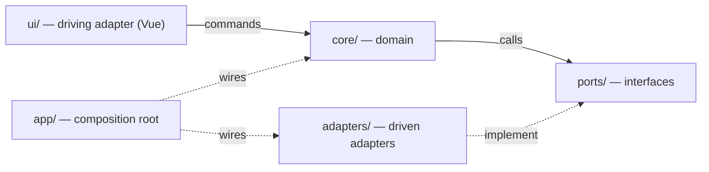
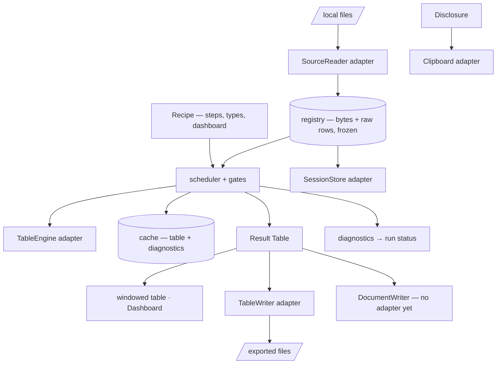
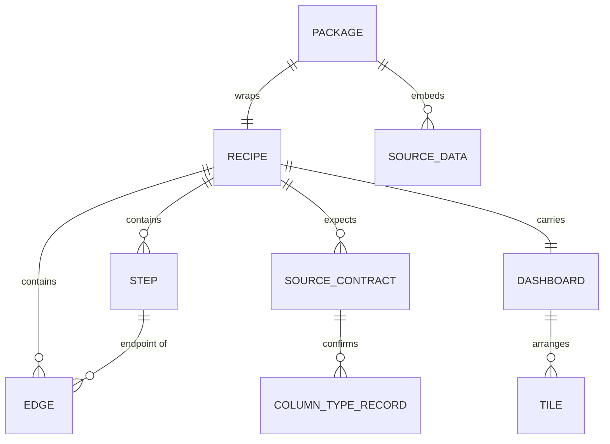

# Architecture Spine — querbeet

## Design Paradigm

**Hexagonal (ports and adapters), with a pipes-and-filters domain inside the core.**

The core holds the Recipe model, the Step graph, the execution engine and the type system, and it is written in plain JavaScript — no Vue, no DOM, no browser API. Everything the product touches from outside sits behind a port, and the only place a library name appears is an adapter.

Two properties of this product decide the paradigm. A Recipe enters through **three doors** — the Editor, the clipboard from a language model, and a loaded file or Package — and FR-28 requires identical validation at each; one core makes that structural instead of a discipline. And **every hard constraint sits at an edge**: the opaque `file://` origin, the absence of a network, the single-file build, blob-URL classic workers. A core that knows nothing about them is immune to them and testable outside a browser.

| Layer | Directory | Holds |
| --- | --- | --- |
| Domain | `core/` | Recipe model, Step graph, scheduler, type and locale system, validators, Column Profile |
| Ports | `ports/` | The interfaces the core calls outward through |
| Driven adapters | `adapters/` | The implementations — every library import lives here |
| Driving adapter | `ui/` | Vue components, composables, panes; issues commands, renders projections |
| Composition root | `app/` | Wires adapters into ports, owns startup and the build version |

## Invariants & Rules

### AD-1 — Dependency direction

- **Binds:** all
- **Prevents:** a domain rule reachable only through a framework, and a core that cannot be tested or replaced
- **Rule:** `core/` imports from `core/` and `ports/` only. `adapters/` implement `ports/` and may import anything. `ui/` may import `core/` and `ports/`, never `adapters/`. Only `app/` names a concrete adapter. No import points from `core/` outward. Enforced by a lint rule, not by review.



### AD-2 — The core is framework-free and browser-free `[ADOPTED]`

- **Binds:** `core/`, all Step kinds, the validators, the type system
- **Prevents:** a framework swap becoming an architectural rewrite; domain logic that cannot run under Vitest
- **Rule:** no import of Vue, no DOM access, no `window`, `document`, `File`, `Blob`, `indexedDB` or `fetch` anywhere under `core/`.

### AD-3 — The UI is a driving adapter, not a peer of the core

- **Binds:** FR-1, FR-8, FR-11, FR-12, FR-19, FR-31, FR-35
- **Prevents:** browser objects leaking into the domain and pinning it to a browser
- **Rule:** a browser `File`, `DragEvent` or `ClipboardEvent` never reaches `core/`. `ui/` unwraps it and issues a command carrying bytes and a name. Byte decoding is not a UI concern: `ui/` passes an `ArrayBuffer`, and the encoding ladder of FR-2 runs in `core/types`.

### AD-4 — Every Step is a pure synchronous function `[ADOPTED, amended]`

- **Binds:** FR-13 – FR-18, FR-39, every Step kind added later
- **Prevents:** hidden state in a Step, and a Step that cannot be memoized or re-run
- **Rule:** a Step is `(engine, inputs: Table[], config) => { table: Table, diagnostics: Diagnostic[] }`. The engine arrives as a parameter (AD-19); a Step never imports one. No I/O, no clock, no randomness, no mutation of its inputs.

### AD-5 — Step boundaries carry a Table handle; rows materialize only at the edges

- **Binds:** `core/`, every Step kind, `ports/`
- **Prevents:** one Step author returning an engine table and another returning plain rows, and per-boundary conversion cost nobody budgeted
- **Rule:** between Steps a `Table` handle crosses, behind querbeet's own narrow interface. The interface is `rows()`, `rowCount()`, `schema()` and `column(name)` — `schema()` is mandatory because FR-13's column union, FR-16's enumeration, FR-21's Input Contract and FR-26's Column Profile all need columns and types without materializing rows. `rows()` yields plain frozen row objects and is called only at real edges: preview, export, `SessionStore`, worker transfer. **This supersedes the addendum's reversibility seam, which names plain arrays of objects as the boundary contract**; replaceability moves from the row shape into the interface. The per-boundary conversion cost this avoids is unmeasured — R4 measured only the whole pipeline, at 263–446 ms for 100,000 rows.

### AD-6 — Datasets never enter the graph model, and never enter reactive state `[ADOPTED, amended]`

- **Binds:** FR-12, FR-25, NFR-3, the whole `ui/` layer
- **Prevents:** the 437–479 MB and 11–13× read penalty R2 measured for a dataset inside Vue's deep reactivity
- **Rule:** tables live in a registry keyed by Source id and Step id, held as a plain `Map` in `core/`. The graph model holds ids, never data. Rows are frozen where produced. **Neither a row array nor a `Table` handle may be placed in `ref`, `reactive` or a `computed` return value** — since AD-5 moved handles across boundaries, `Object.freeze` no longer guards this on its own, so the rule is explicit. `ui/` holds tables only through `shallowRef` and never copies one into reactive state.

### AD-7 — The registry holds source bytes and raw parsed tables; typing is Step zero

- **Binds:** FR-2, FR-3, FR-6, FR-7, FR-8, FR-9, FR-20, FR-21, FR-24, FR-38, FR-39
- **Prevents:** a registry whose content depends on which Recipe is loaded, and a re-parse with no input to re-parse from
- **Rule:** the registry holds, per Source, **the original bytes** and the raw parsed table — values as delivered, not yet typed. The bytes are what FR-2's encoding change, FR-3's delimiter and header change, FR-7's array strategy change, FR-6's repair diff, FR-39's damaged raw rows and FR-24's Package all read from; discarding them makes six requirements unbuildable. The Recipe's per-column type record is applied by the engine as Step zero of every Source and caches like any other Step, so swapping Recipes leaves the registry untouched.

### AD-8 — The per-Step cache is content-addressed, carries diagnostics, and is bounded

- **Binds:** FR-19, FR-34, FR-37, FR-38, `core/exec`
- **Prevents:** two invalidation schemes disagreeing about staleness; a re-parsed Source served from the old entry; a repeat run reporting clean over warnings it never re-emitted
- **Rule:** `key(step) = hash(canonical(config) + key(inputs))`, with the base case `key(source) = hash(byteDigest + parseConfig)` — **a Source id alone is not a key**, because FR-2, FR-3, FR-7 and FR-39 all re-parse without changing the id. **A cache entry stores the table and its diagnostics together**, and a hit replays the diagnostics; FR-34's run status is otherwise silent on every repeat run, and FR-37's document would certify a clean run over a Cartesian product. The cache is bounded by total retained rows with least-recently-used eviction; eviction is a cache miss, never a wrong answer.

### AD-9 — Cancellation is between Steps; row-slicing inside a Step is restricted

- **Binds:** FR-34, FR-38, NFR-3
- **Prevents:** an execution the user cannot stop, and a chunked Step computing a wrong aggregate
- **Rule:** the scheduler yields and checks cancellation **between Steps**, through the message queue — `SharedArrayBuffer` is hidden from `file://` in both engines and a `typeof` check reports the opposite of the truth. Exit latency is therefore one Step, not one chunk: R4 measured 578.6 ms (Chromium) / 1,156 ms (Firefox) for the heaviest single-Step case, and that is the number the affordance is designed against. Inside a Step, row-range chunking is permitted **only for row-independent kinds** — Filter, Columns, Computed Column, typing — and is **forbidden for Aggregate, Join and Union**, where a partial view computes partial groups, misses cross-chunk matches, and recomputes a per-chunk column union.

### AD-10 — All model change goes through named commands

- **Binds:** FR-11, FR-12, FR-20, FR-21, FR-23, FR-28, FR-32, FR-35, FR-9
- **Prevents:** a graph mutation that skips the cycle guard, and two writers racing the editor projection
- **Rule:** `ui/` never mutates the model. It issues named commands — `addStep`, `connect`, `reconfigure`, `deleteStep`, `loadRecipe`, `confirmTypes`, `mapContractColumn`, `configureTile` — which the core applies after its guards. **Every field that lives in the Recipe is reached this way**, the Dashboard and the type confirmation included; a Tile edited directly would be a second owner of Recipe state. The cycle guard runs inside the command path, in front of the editor library's mutation API, which the Editor spike measured as containing no cycle detection at all. One watcher projects the model outward; nothing else writes to the editor library.

### AD-11 — One validator, three doors

- **Binds:** FR-20, FR-21, FR-22, FR-23, FR-28, FR-29
- **Prevents:** the clipboard path accepting a Recipe the file path would refuse
- **Rule:** every Recipe and every Probe Query passes the same validator in `core/recipe`, whether it came from the Editor, the clipboard or a file. An unrecognised field is refused, not ignored — a validator that accepts what it does not understand cannot tell a Probe Query from a Recipe. A refusal carries a machine-facing text produced in `core/recipe`, because its reader is a language model rather than the user; this is the one exception to AD-13's rule that `core/` emits codes and never prose.

### AD-12 — A Recipe carries a format version and a mismatch is refused

- **Binds:** FR-20, FR-21, FR-24
- **Prevents:** an old Recipe silently producing a different result under a newer build
- **Rule:** every Recipe and Package carries a format version. The loader refuses a version it does not implement, naming both versions. No migration in the MVP. `app/` surfaces the build version where a Consumer can read it back to the Author.

### AD-13 — Diagnostics have one shape, and the core emits no prose

- **Binds:** FR-6, FR-9, FR-13, FR-14, FR-15, FR-18, FR-22, FR-34, FR-39, NFR-6
- **Prevents:** a run status that cannot aggregate what its Steps reported, and German strings compiled into a framework-free core
- **Rule:** every Step, loader and validator emits `{ severity, code, values, stepId?, sourceId? }`. **`severity` is `info | warning | error | unresolved`** — the fourth exists because FR-9's "nothing settles this" and FR-22's "doubtful" are neither warnings nor errors but states awaiting a person. **`values` is a structured map**, so FR-13's, FR-14's, FR-15's and FR-18's row counts travel as numbers rather than inside a sentence. `code` is stable and machine-readable. `core/` emits codes and values; `ui/` renders the German text (NFR-6). FR-34's run status is the aggregation of this stream and adds nothing of its own.

### AD-14 — Identifiers are short, readable and stable

- **Binds:** FR-20, FR-24, FR-27, FR-28
- **Prevents:** a Recipe a language model cannot author, and ids that change across a save/load round trip
- **Rule:** ids are short readable strings — `src:patch`, `s1`, `s2` — minted by the core, unique within a Recipe, never reused after a deletion. No UUIDs: FR-28 requires a model to write them. A Recipe round-trips byte-identically.

### AD-15 — querbeet creates workers for the two exports only

- **Binds:** FR-36, NFR-1, NFR-3
- **Prevents:** a dataset moved off-thread in order to compute on it, which R4 measured as a straight loss
- **Rule:** **querbeet's own code** creates a worker for XLSX export and Parquet export and for nothing else, owned inside the `TableWriter` adapter. A dependency may create its own — `read-excel-file` spawns fflate blob-URL workers on the import path — so this rule constrains querbeet, and `new Worker` is not a usable gate signal on the built artefact. Workers are classic scripts from a blob URL, imported `?worker&inline` with `worker.format = 'iife'`, the only form measured to work from `file://` in both engines. A dataset is never sent to a worker to be computed on: a structured clone of 100,000 rows blocks the sender for 109.4 / 132 ms and 510.8 / 627 ms at half a million, against 263–446 ms for the whole pipeline.

### AD-16 — Session storage is namespaced, and isolation is never claimed

- **Binds:** FR-24, FR-25, NFR-8
- **Prevents:** two copies of `querbeet.html` silently sharing one session, and a UI that implies a privacy boundary the platform does not provide
- **Rule:** the `SessionStore` port's database name and keys carry a discriminator. This makes collisions *legible*; it does not isolate anything — R9 measured the `file://` origin as one bucket shared across directories in both engines, and querbeet cannot partition it from the inside. No interface text may imply otherwise. `navigator.storage.persist()` is never awaited unguarded: it never settles in Firefox from `file://` and deadlocked a probe for 180 s. Restored state is treated as possibly incomplete. **This rule is not testable under Playwright's bundled Firefox**, which ships `security.fileuri.strict_origin_policy: false` and is more permissive than a real double-click.

### AD-17 — Nothing is fetched at runtime `[ADOPTED]`

- **Binds:** NFR-1, NFR-2, all adapters
- **Prevents:** a build that works from a dev server and fails from a double-clicked file
- **Rule:** no `fetch`, no lazy chunk, no CDN link, no sibling config file, no external font or stylesheet. A `file://` page has an opaque origin and anything it fetches fails CORS. Data enters only through file input or drag-and-drop; a model is reached only through the clipboard.

### AD-18 — The build emits exactly one file, asserted where the assertion can fail

- **Binds:** NFR-1, NFR-2, FR-36
- **Prevents:** the documented silent failure where an idiomatic worker or a lazy import splits the bundle with no build-time signal
- **Rule:** the build asserts that `dist/` contains exactly one entry — a filesystem check, independent of any browser. **The network assertion runs in Chromium only.** Measured: Playwright's Firefox reports 1 of 5 requests from a `file://` page, because it observes HTTP channels and `file://` is not one, so a split bundle would pass green. A green Firefox network check is not evidence and must not be written as if it were.

### AD-19 — The transformation engine sits behind a port and absorbs its own hazards

- **Binds:** FR-13 – FR-18, FR-39, AD-4, AD-5
- **Prevents:** a library import inside `core/`, and each Step author rediscovering the same measured hazard
- **Rule:** `ports/TableEngine` defines the operations Steps need; `adapters/arquero/` implements it against Arquero, pinned and vendored. **The adapter absorbs the hazards, not the Step kinds:** null join keys drop rows silently while the obvious sentinel fix multiplies them — measured at 28,000 source rows producing 2,687,670 join rows and a crashed tab at 100k, so the adapter reports null-key counts and refuses the sentinel; a column-set mismatch on concatenation drops columns silently, so union computes an explicit column union first; the CSV entry points of the engine are not used, since parsing belongs to `SourceReader`; and a written CSV carries a BOM. Arquero has had no upstream commit in 14 months and the addendum keeps a fork plan rather than a fork.

### AD-20 — A reader declares the domain of every cell it delivers

- **Binds:** FR-1, FR-8, FR-9, FR-14, FR-15, FR-18, FR-26
- **Prevents:** the confirmation gate degrading into a rubber stamp for the natively typed formats
- **Rule:** `SourceReader` returns, per column, the cells **and a declaration of what it delivered** — `text`, or `native:<type>` for XLSX and Parquet, which carry real types where CSV and JSON carry strings. Step zero honours the declaration instead of assuming strings: a natively typed column skips locale inference but **still passes the missing-value and unparsed sweep**, because what counts as missing changes null shares (FR-26), grouping (FR-18), join matching (FR-14) and "is empty" (FR-15) in every format alike. FR-9 presents a native column as pre-typed and still confirmable.

### AD-21 — One temporal representation inside a Table

- **Binds:** FR-9, FR-14, FR-15, FR-17, FR-36, FR-37
- **Prevents:** a day-difference off by one across a join between two formats, and two writers emitting different calendar days from one cell
- **Rule:** a date-typed column holds **UTC-midnight epoch milliseconds**; a datetime column holds UTC epoch milliseconds. Readers normalize on the way in — a parser yielding local midnight and a Parquet reader yielding epoch days both converge here — and writers format from it on the way out. No `Date` object with an implicit local zone crosses a Step boundary. The display locale is a rendering concern and never reaches a Table or a Recipe.

### AD-22 — An unparsed value is a boxed cell, and the engine adapter handles it once

- **Binds:** FR-9, FR-15, FR-17, FR-18, FR-31, FR-36
- **Prevents:** an unparsed marker vanishing across a join, and a column the user never created appearing in every enumeration
- **Rule:** a value that does not parse under its confirmed type is held as a box carrying the original text, in the cell itself, so it survives joins and aggregates by construction. **The `TableEngine` adapter is the single place that knows the box**: comparison never matches one, aggregation skips it and counts it into a diagnostic, sorting groups boxes together, and export writes the original text. A Step kind never inspects a box, which is what keeps this from becoming a rule that every Step must remember.

### AD-23 — One disclosure value, and only the Clipboard port accepts it

- **Binds:** FR-26, FR-27, FR-29, FR-30, NFR-8
- **Prevents:** a second, laxer path out of the machine — the exact failure NFR-8's "there is no other path out" forbids and §6.2 binds a future API path against
- **Rule:** everything that may leave for a model is assembled in `core/profile` into one `Disclosure` value carrying exactly what will be sent. The `Clipboard` port's signature **accepts nothing else**, so no code path can send anything the user did not see. FR-27's block, FR-29's Probe Query result and FR-30's released samples are all constructed as one, and a post-MVP API adapter binds to the same value by construction rather than by promise.

### AD-24 — The Result table is windowed, and the scroll extent is guarded

- **Binds:** FR-31, FR-32, FR-33, NFR-3, NFR-4
- **Prevents:** a table that silently renders nothing at the NFR-3 design target
- **Rule:** the Result and every preview render through fixed-height row windowing, roughly a 50-row window, with no column virtualization. **The spacer height is clamped below the engine scroll-extent limit** — Firefox collapses an oversized spacer to zero height at roughly 614,000 rows at 28 px, where Chromium clamps and keeps working — and beyond the clamp the table pages rather than scrolls. The guard ships regardless of whether Firefox remains a target. FR-32's view predicate lives in `core/` so that promoting it to a Filter Step is the same value, not a re-expression of it.

### AD-25 — A run has an identity and a timestamp, taken from a port

- **Binds:** FR-34, FR-37, FR-25
- **Prevents:** a compliance artifact that cannot say when it was produced, and a clock inside a pure core
- **Rule:** every execution has a run id and a start time, taken from a `Clock` port so AD-4's purity holds. Diagnostics, the run status and the exported document all carry them. FR-37's document names its Recipe, its Sources and this timestamp, which is what makes it filable six months later.

### AD-26 — Charts render as vector, and three settings are not optional

- **Binds:** FR-35, FR-37
- **Prevents:** an export degrading from vector to raster with no error, and a tile that renders unreadably
- **Rule:** the `ChartRenderer` adapter registers the SVG renderer **alone** — with both registered, asking for SVG returns a PNG silently, and FR-37's vector-with-selectable-text guarantee dies quietly. Every tile sets a long-label strategy, since a 60-character category label escapes the plot by 15–21 px, and a maximum bar width, since a single-category tile otherwise renders as a 237 px slab in a 346 px plot. The renderer does not observe its container, so a tile resize explicitly calls resize. The port owns one lifecycle — create, update, resize, dispose — and the adapter never outlives its tile.

### AD-27 — The browser matrix and the test envelope are rules, not preferences

- **Binds:** NFR-3, NFR-4, all
- **Prevents:** a measurement claimed for an engine nobody ran it in
- **Rule:** Chromium is the lead engine and every performance claim is measured there; Firefox is measured rather than assumed and is dropped rather than specially accommodated. `core/` is tested under Vitest with no browser. The built artefact is tested under Playwright from a `file://` URL, subject to AD-18's Chromium-only network caveat and AD-16's untestable isolation caveat. A rule stated here without a test that could fail is a rule that will rot.

### AD-28 — The view document sits behind its own port

- **Binds:** FR-37
- **Prevents:** the document export being wired into the tabular writers, whose contract is a table rather than a paginated document
- **Rule:** `ports/DocumentWriter` produces the self-contained HTML and the paginated PDF, separately from `TableWriter`. **No adapter implements it yet** — research R8 is written and unrun — so the port is defined and the capability is unavailable rather than half-built. It receives the Result, the Dashboard, the run status and the run identity of AD-25.

### AD-29 — Execution has three gates and none may be bypassed

- **Binds:** FR-9, FR-22, FR-34, FR-38
- **Prevents:** a number produced from unconfirmed types or unchecked inputs — the failure the whole product exists to avoid
- **Rule:** no Pipeline executes until the type mapping of every Source is confirmed (FR-9), the Pre-flight Check has been shown (FR-22), and the execution mode in force is visible to the user (FR-38). The gates live in the scheduler, not in the UI, so no second caller can reach execution around them. The mode is derived from the loaded row count against a stated threshold and is state the UI reads, never state the UI decides.

### AD-30 — Every action is reachable by keyboard, and nothing is typed

- **Binds:** NFR-7, NFR-9, FR-12, FR-17, FR-35
- **Prevents:** an interaction that exists only as a pointer gesture, and a syntax surface entering through a component
- **Rule:** no interaction exists only as a pointer gesture; a drag computes a target and updates the model through a command (AD-10), never by reordering DOM nodes. No component accepts a formula, expression, query or script in the MVP: every transformation is a configured Step, which is also what keeps FR-28 tractable. Both rules are structural because both are MVP boundaries a component author would otherwise cross locally.

## Consistency Conventions

| Concern | Convention |
| --- | --- |
| Naming — entities | The PRD Glossary governs: Source, Step, Pipeline, Recipe, Package, Result, Dashboard, Tile, Author, Consumer. Code uses the same words, capitalised as types. |
| Naming — files | `core/` and `adapters/` are lower-kebab `.js`; Vue components are PascalCase `.vue`; one Step kind per file under `core/steps/`. |
| Naming — ports | A port is a noun of role, not of technology: `SourceReader`, `TableWriter`, `DocumentWriter`, `TableEngine`, `SessionStore`, `ChartRenderer`, `GraphView`, `Clipboard`, `Clock`. |
| Data — ids | Short readable strings, prefixed by kind (`src:`, `s`, `tile:`). See AD-14. |
| Data — comparison values | Canonical machine form only: a number is a number, a date is an ISO 8601 string in the Recipe and UTC-midnight epoch milliseconds in a Table (AD-21). Never a display form. Enforced at ingest, never coerced silently. |
| Data — CSV parsing | Automatic type coercion in the parser is permanently off; typing is Step zero and nowhere else (AD-7, AD-20). |
| Data — diagnostics | The one shape in AD-13. `code` stable and machine-readable, `values` structured, prose rendered in `ui/`. |
| Data — Recipe serialization | One canonical serializer, key order fixed, used for both the file and the cache key hash. Byte-identical round trip is a test. |
| State — mutation | Named commands only (AD-10). No component writes to the model. |
| State — reactivity | `shallowRef` for anything holding a table; deep reactivity is for the graph model only, which holds no data (AD-6). |
| State — errors | A port failure surfaces as a `Diagnostic` with `severity: error`, never as a thrown string. The core throws only on a programming error. |
| Cross-cutting — language | Interface German, code and comments English (NFR-6). User-facing prose lives in `ui/`; the sole exception is AD-11's machine-facing refusal text. |
| Cross-cutting — logging | No logging framework and no telemetry. Diagnostics are the only reporting channel. |
| Cross-cutting — config | No runtime configuration file — AD-17 forbids reading one. Build-time constants only. |

## Stack

Seed, inherited from research runs R1–R9 and re-verified against the registries on 2026-08-02. Twelve of thirteen pins are current; the exceptions are noted. Permanent constraints that happen to attach to a library are rules, not stack rows — see AD-19, AD-20 and AD-26.

| Name | Version |
| --- | --- |
| Vue | 3.5.40 |
| `vite-plugin-singlefile` | 2.3.3 — see Deferred, the Vite pin is an open question |
| Arquero | 8.0.3, pinned and vendored; no upstream commit in 14 months |
| Vue Flow | 1.48.2 — MIT across core and addons, verified in the shipped bundle |
| Apache ECharts | 6.1.0 |
| PapaParse | 5.5.4 |
| `write-excel-file` / `read-excel-file` | 4.1.1 / 9.3.5 |
| `hyparquet-writer` / `hyparquet` | 0.16.3 / 1.27.1 — 0.16.4 shipped 2026-08-01, one patch ahead |
| `jsonrepair` | 3.15.0 |
| `json-formatter-js` | 2.5.23 |
| `date-fns` | 4.4.0 |
| Tailwind CSS | v4.3.3, `preflight.css` omitted from the split import |
| IndexedDB | platform, no library |
| Vitest / Playwright | test substrate, current |

## Structural Seed

```text
querbeet/
  core/
    recipe/      # model, canonical serializer, validator, Input Contract, version gate
    graph/       # Steps, edges, cycle guard, topological order, orphan marking
    steps/       # one file per Step kind: union, join, filter, columns, computed, aggregate, typing
    exec/        # scheduler, gates, cancellation, content-addressed cache, registry
    types/       # encoding ladder, locale detection, candidate loop, type record, missing values
    profile/     # Column Profile, the FR-27 prompt block, the Disclosure value
    diagnostics/ # the one Diagnostic shape and its codes
  ports/         # SourceReader TableWriter DocumentWriter TableEngine SessionStore
                 # ChartRenderer GraphView Clipboard Clock
  adapters/
    arquero/                      # TableEngine
    csv/ json/ xlsx/ parquet/     # SourceReader + TableWriter
    indexeddb/                    # SessionStore
    echarts/                      # ChartRenderer
    vueflow/                      # GraphView
    clipboard/ clock/             # Clipboard, Clock
  ui/            # panes, Editor, windowed table view, Dashboard, dialogs
  app/           # composition root, startup, build version
```





## Capability → Architecture Map

| Capability / Area | Lives in | Governed by |
| --- | --- | --- |
| Loading Sources (FR-1 – FR-8, FR-39) | `adapters/{csv,json,xlsx,parquet}` behind `SourceReader`; encoding in `core/types` | AD-3, AD-7, AD-13, AD-20 |
| Typing and annotation (FR-9, FR-10) | `core/types`, applied by `core/exec` | AD-7, AD-20, AD-21, AD-22, AD-29 |
| Pipeline graph (FR-11 – FR-18) | `core/graph`, `core/steps`, `adapters/arquero` | AD-4, AD-5, AD-10, AD-19 |
| Preview and execution (FR-19, FR-34, FR-38) | `core/exec` | AD-8, AD-9, AD-25, AD-29 |
| Recipes, contracts, Packages (FR-20 – FR-25) | `core/recipe`, `adapters/indexeddb` | AD-11, AD-12, AD-14, AD-16 |
| LLM collaboration (FR-26 – FR-30) | `core/profile`, `core/recipe`, `adapters/clipboard` | AD-11, AD-17, AD-23 |
| Result view and Dashboard (FR-31 – FR-35) | `ui/`, `adapters/echarts` | AD-6, AD-10, AD-24, AD-26 |
| Data export (FR-36) | `adapters/{csv,json,xlsx,parquet}` behind `TableWriter` | AD-15, AD-18, AD-21 |
| View document (FR-37) | `ports/DocumentWriter` — unimplemented | AD-25, AD-26, AD-28 |
| Editor surface (FR-11, FR-12) | `ui/`, `adapters/vueflow` behind `GraphView` | AD-10, AD-30 |

## Deferred

- **The view-document adapter (FR-37).** R8 is written and unrun. `ports/DocumentWriter` (AD-28) fixes the contract; no implementation exists, so the capability is absent rather than half-built.
- **The Package container (FR-24).** R9 is answered only at its IndexedDB gate. Whether the container is a zip, and whether it stores data as Parquet internally, is open. AD-7's retained bytes and AD-16's namespacing already bound what it must fit between.
- **The Vite major version.** The plugin is pinned at 2.3.3; which Vite it is pinned against is not settled, because Vite 8 replaced its bundler and the plugin's single-file path under it has open upstream issues. Resolve by building, not by reading — AD-18's one-file assertion is the test.
- **Undo and redo.** Not in the MVP requirements. AD-10 makes it cheap later, since the commands are already the record.
- **Recipe format migration.** AD-12 refuses a version mismatch instead. The PRD names it as the first post-MVP candidate.
- **Graph auto-layout.** The editor library ships none and the MVP has no requirement for it.
- **The Consumer's first-run surface.** PRD Open Question 1 gates it on an uninterviewed user. The Recipe machinery it sits on is decided here; only its presentation waits.
